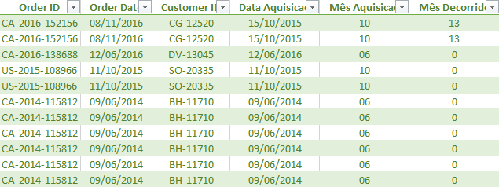
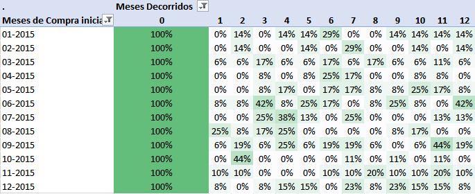

# 📊 Análise de Retenção de Clientes
### Cohort Analysis em E-commerce (Superstore)

> Como identifiquei que uma empresa perdia mais da metade dos clientes no primeiro mês — e o que isso significa estrategicamente.

---

## 🏢 Contexto de Negócio

A análise foi realizada sobre o dataset **Superstore**, um e-commerce com transações registradas a partir de 2015.

O objetivo foi compreender a dinâmica de retenção mensal a partir da primeira compra de cada cliente, identificando padrões de recorrência e oportunidades estratégicas de melhoria.

---

## ❓ Problema

Apesar do volume de vendas, havia dúvidas sobre a recorrência dos clientes:

- Qual a taxa de recompra no primeiro mês após aquisição?
- Em quanto tempo os clientes deixam de comprar?
- Existem padrões sazonais de retenção?
- Qual o potencial de LTV da base?

---

## 🎯 Objetivo

Avaliar a retenção de clientes mês a mês com base no mês de aquisição, identificando:

- Taxa de recompra inicial
- Tempo de evasão
- Padrões sazonais
- Potencial de LTV

---

## 📂 Dataset

O dataset contém transações de um e-commerce com identificação de cliente e datas de compra, entre outros dados.

---

## 🔍 Processo de Análise

**Tratamento e Modelagem dos Dados:**

1. Remoção de colunas desnecessárias e preparação no Power Query
2. Conversão e padronização de datas com configuração regional
3. Validação de tipos de dados
4. Criação das colunas de Data de Aquisição e Tempo decorrido desde a primeira compra
5. Identificação da primeira compra de cada cliente
6. Construção do Mês de Aquisição (início do mês da primeira compra)
7. Cálculo do intervalo mensal entre cada transação e a aquisição
8. Modelagem da matriz cohort via Tabela Dinâmica
9. Cálculo da taxa percentual de retenção por período
10. Aplicação de formatação condicional para construção do Heatmap
11. Avaliação dos resultados e extração de insights estratégicos

---

## 📊 Visualizações

### Planilha Cohort

### Tabela de Cohort (Heatmap)

---

## 💡 Principais Resultados

- A retenção média no **primeiro mês** após aquisição foi inferior a **15%**, indicando alta evasão inicial
- Queda superior a **50%** entre o Mês 0 e Mês 1 em todos os cohorts
- Após o segundo mês, a retenção estabiliza em patamar inferior a **20%**
- Cohorts adquiridas em **junho e agosto** apresentaram picos de retenção de 40–50% em meses subsequentes, sugerindo efeito sazonal ou campanhas específicas
- O comportamento geral indica **baixa recorrência de curto prazo** e retenção residual após o quarto mês

---

## 🎯 Insights Estratégicos

A maior perda ocorre nos **primeiros 30 dias** após a aquisição, sugerindo que estratégias focadas na segunda compra podem gerar impacto significativo no LTV.

A retenção limitada ao longo do tempo indica potencial **dependência de aquisição contínua** para sustentação de receita.

A variação entre cohorts sugere **influência sazonal**, o que pode orientar planejamento promocional.

---

## ⚠️ Limitações

- Ausência de dados sobre canal de aquisição
- Não segmentação por perfil demográfico
- Análise descritiva, não preditiva

---

## 🚀 Próximos Passos Sugeridos

- Implementar análise **RFM** para segmentação comportamental
- Testar campanhas direcionadas entre **30–60 dias** após primeira compra
- Desenvolver modelo preditivo de **churn**
- Investigar sazonalidade em cohorts de maior desempenho

---

## ✅ Conclusão

A análise demonstra como a aplicação de Cohort Analysis em Excel pode gerar insights estratégicos relevantes sobre retenção e recorrência, apoiando decisões voltadas para crescimento sustentável e aumento de LTV.

---

## 🛠️ Ferramentas Utilizadas

- Microsoft Excel
- Power Query
- Tabelas Dinâmicas
- Formatação Condicional (Heatmap)
- Análise de Retenção (Cohort Analysis)

---

## 🔗 Portfólio Completo

Acesse meu portfólio para ver este e outros projetos:
👉 [biconte.wixsite.com/portf](https://biconte.wixsite.com/portf)

---

*Desenvolvido por **Bianca Conte Lucio***
